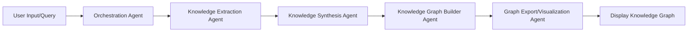

# Career Roadmap Knowledge Graph Generator

This project is a Streamlit application that generates a career roadmap as a knowledge graph, visualizing the learning path for a specific domain.

## Project Structure

The core logic of this multi-agent system resides in the `MultiAgentGraph/knowledge_graph_builder/` directory, which contains the following main subdirectories:

*   `agents/`: Core AI agents (e.g., researcher, synthesizer, mapper).
*   `helpers/`: Consolidated utilities and external tool wrappers.
*   `workflows/`: Agent orchestration and flow definitions.
*   `data/`: (Optional) For input/output data.

## File Structure

This project is structured to facilitate a modular and scalable multi-agent system. Below is an overview of the key directories and files:

*   **`agents/`**: Contains the implementations of various specialized AI agents, each responsible for a specific task within the knowledge graph generation pipeline.
    *   `researcher.py`: Implements the **Knowledge Extraction Agent**, responsible for gathering raw information.
    *   `synthesizer.py`: Implements the **Knowledge Synthesis Agent**, which processes and refines extracted information.
    *   `mapper.py`: Implements the **Knowledge Graph Builder Agent**, responsible for constructing the graph structure.

*   **`helpers/`**: This consolidated directory contains reusable modules that provide external functionalities (formerly `tools/`) and general utility functions (formerly `utils/`) for the agents and application logic.
    *   `serpapi_tool.py`, `wikipedia_tool.py`: These files contain wrappers or direct implementations for interacting with external services and APIs (e.g., web search) that the agents might use for data collection or validation.
    *   `config.py` (if present): Often used for managing application configurations and settings.

*   **`workflows/`**: Defines the orchestration logic and state management for the multi-agent system, particularly if using frameworks like LangChain/LangGraph.
    *   `langgraph_router.py`: This file is central to defining the multi-agent workflow. It orchestrates the flow between different agents and tools, often handling conditional routing and state transitions based on the process requirements.

*   **`data/`**: (if present) Typically used for storing any data-related files, such as raw inputs, processed outputs, or static assets.

*   **`app.py`**: The main Streamlit application file. It serves as the user interface, handles user inputs, and initiates the multi-agent workflow by interacting with the orchestration logic.

*   **`setup.py`**: A standard Python file used for packaging and distributing the project. It defines metadata about the project (like its name, version, dependencies) and specifies how the project can be installed.

## Repository

You can find the source code for this project on GitHub:
[https://github.com/srini118us/Agents]

## How to Run

1.  **Navigate to the project directory**:
    ```bash
    cd MultiAgentGraph/knowledge_graph_builder/
    ```
2.  **Ensure dependencies are installed**:
    If you haven't already, install the required Python packages (e.g., `streamlit`, `graphviz`, etc.). You can typically find these in `requirements.txt` within this directory.
    ```bash
    pip install -r requirements.txt
    ```
3.  **Configure Environment Variables (Optional)**:
    If your agents require API keys (e.g., for LLMs or external search services), create a `.env` file in this directory (`MultiAgentGraph/knowledge_graph_builder/`).
    ```
    # Example .env content
    # OPENAI_API_KEY="your_openai_api_key"
    # SERP_API_KEY="your_serpapi_key"
    ```
4.  **Run the Streamlit application**:
    ```bash
    streamlit run app.py
    ```
    This will open the application in your web browser.

## Output

The application generates a visual knowledge graph. Additionally, a static PNG image of the graph is saved as `career_roadmap.png` in this directory (`MultiAgentGraph/knowledge_graph_builder/`).

## Agent Flow

The knowledge graph generation process involves multiple specialized agents working in a coordinated pipeline to transform a user's request into a structured visual roadmap.

